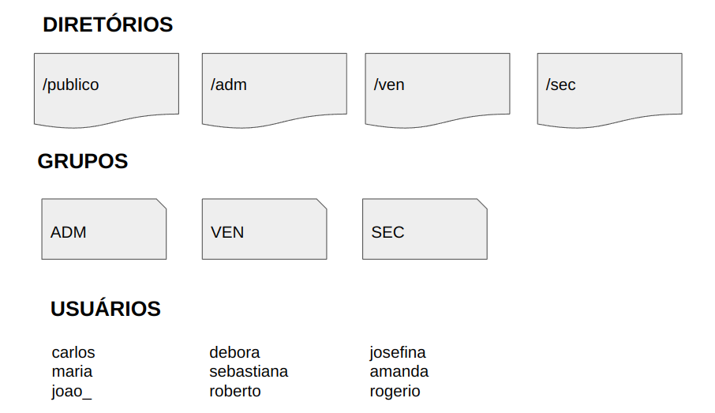
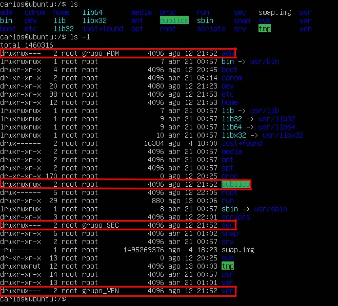
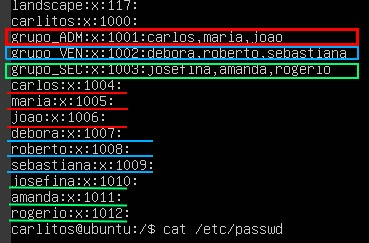
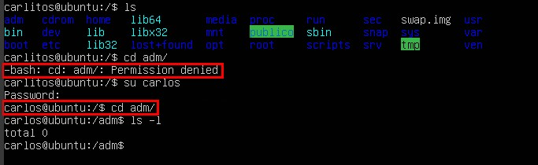
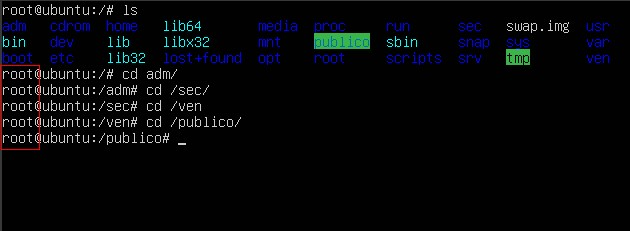

# Gerenciamento de usuarios


### O que é IaC?

Infraestrutura como código (IaC) é o gerenciamento e provisionamento da infraestrutura por meio de códigos, em vez de processos manuais. Com a IaC, são criados arquivos de configuração que incluem as especificações da sua infraestrutura, facilitando a edição e a distribuição de configurações. Ela também assegura o provisionamento do mesmo ambiente todas as vezes.

<br/>

### Principal benefício:

Ao automatizar o provisionamento da infraestrutura com a IaC, os desenvolvedores não precisam provisionar e gerenciar manualmente servidores, sistemas operacionais, armazenamento e outros componentes de infraestrutura sempre que criam ou implantam uma aplicação.

<br/>

### Objetivos do projeto:

* Todo provisionamento deve ser feito em um arquivo do tipo Bash Script;

* O dono de todos os diretórios criados será o usuário root;

* Todos os usuários terão permissão total dentro do diretório publico;

* Os usuários de cada grupo terão permissão total dentro de seu respectivo diretório;

* Os usuários não poderão ter permissão de leitura, escrita e execução em diretórios de departamentos que eles não pertencem;

* Subir arquivo de script criado para a sua conta no GitHub.

<br/>

### Projeto



<br/>

Primeiro vamos precisar criar um arquivo Shell, usando o bash podemos passar o comando `touch iacl.sh`. Para editar o arquivo desse projeto, foi usado o editor de texto nano, para abrir e editar o o arquivo basta digitar `nano iacl.sh`. Já com o nano aberto, o primeiro passo é criar os diretórios 

<br/>


```shell
#!/bin/bash

echo "criando diretórios"

mkdir /publico
mkdir /adm
mkdir /ven
mkdir /sec

```
<br/>



O segundo passo é criar os usuários, para isso vamos usar o camando `useradd + nome`,  `-c` adiciona um comentário, `-m` irá criar um diretório do usuário no /home, `-s` serve para definir a shell de cada usuário,  `-p $(openssl passwd -5 Senha)` define a senha do usuário, `-G` adiciona o usuśrio a um grupo.  
```shell
echo "Criando usuários"

useradd carlos -m -c "carlos eduardo" -s /bin/bash -p $(openssl passwd -5 Senha123) -G grupo_ADM
useradd maria -m -c "maria eduarda" -s /bin/bash -p $(openssl passwd -5 Senha123) -G grupo_ADM
useradd joao -m -c "joao silva" -s /bin/bash -p $(openssl passwd -5 Senha123) -G grupo_ADM


useradd debora -m -c "debora maria" -s /bin/bash -p $(openssl passwd -5 Senha123) -G grupo_VEN
useradd roberto -m -c "roberto camargo" -s /bin/bash -p $(openssl passwd -5 Senha123) -G grupo_VEN
useradd sebastiana -m -c "sebastiana ribeiro" -s /bin/bash -p $(openssl passwd -5 Senha123) -G grupo_VEN


useradd josefina -m -c "josefina aragao" -s /bin/bash -p $(openssl passwd -5 Senha123) -G grupo_SEC
useradd amanda -m -c "amanda gillbert" -s /bin/bash -p $(openssl passwd -5 Senha123) -G grupo_SEC
useradd rogerio -m -c "rogerio lima" -s /bin/bash -p $(openssl passwd -5 Senha123) -G grupo_SEC
```


Por último definimos o dono e o grupo responsável por cada diretório com o comando `chown "dono":"grupo" "/diretório"`, e para definirmos as permissões usamos o comando `chmod 000 /diretótio`, seguinto a tabela de permissões:


<br/>

~~~shell
echo "Permissões dos diretórios"

chown root:grupo_ADM /adm
chown root:grupo_VEN /ven
chown root:grupo_SEC /sec

chmod 770 /adm
chmod 770 /ven
chmod 770 /sec 
chmod 777 /publico

echo "fim :)"
~~~

<br/>

Se um usuário que não é o dono do diretório ou que não faz parte do grupo autorizado tentar entrar no diretório, a permissão será negada. O único diretório que todos conseguem entrar é o publico.



A definição do usuário root determina que ele tenha controle sobre todos os arquivos no disco, independentemente do usuário e dos grupos que possuem esses arquivos e diretórios.



<br/>

Objetivos|Concluído 
-----|------
Todo provisionamento deve ser feito em um arquivo do tipo Bash Script|✅
O dono de todos os diretórios criados será o usuário root|✅
Todos os usuários terão permissão total dentro do diretório publico|✅
Os usuários de cada grupo terão permissão total dentro de seu respectivo diretório|✅
Os usuários não poderão ter permissão de leitura, escrita e execução em diretórios de departamentos que eles não pertencem|✅
Subir arquivo de script criado para a sua conta no GitHub|✅
